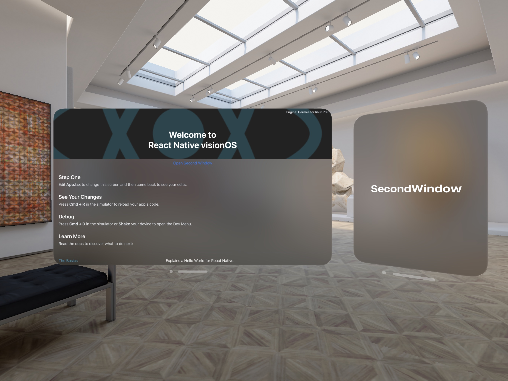

# Window Manager

This API allows you to create multi-window experiences on visionOS.



## Methods

#### **`getWindow`**

```js
getWindow(id: String): Window;
```

The `getWindow` method returns a `Window` object, which contains following properties:

```ts
interface Window {
  id: String;
  open(props?: Object): Promise<void>;
  update(props: Object): Promise<void>;
  close(): Promise<void>;
}
```

## Constants

#### **`supportsMultipleScenes`**

```js
supportsMultipleScenes: boolean;
```

A Boolean value that indicates whether the app may display multiple scenes simultaneously. Returns the value of `UIApplicationSupportsMultipleScenes` key from `Info.plist`.

:::info

## UIApplicationSupportsMultipleScenes

In order to use this API, make sure your app supports multiple scenes. Set `UIApplicationSupportsMultipleScenes` to `true` in `Info.plist`:

```json
<dict>
  <key>UIApplicationSceneManifest</key>
  <dict>
    <key>UIApplicationPreferredDefaultSceneSessionRole</key>
    <string>UIWindowSceneSessionRoleApplication</string>
    <key>UIApplicationSupportsMultipleScenes</key>
    // highlight-next-line
    <true/>
    <key>UISceneConfigurations</key>
    <dict/>
  </dict>
</dict>
</plist>

```

:::

## Example usage

1. Create a new component that will be used as an entry point for the second window:

```tsx title="SecondWindow.tsx"
import { Text, View } from "react-native";
import React from "react";

const SecondWindow = () => {
  return (
    <View>
      <Text>SecondWindow</Text>
    </View>
  );
};

export default SecondWindow;
```

2. In `index.js` use `AppRegistry.registerComponent` to register additional component:

```js title="index.js"
AppRegistry.registerComponent("SecondWindow", () => SecondWindow);
```

### Add native entry point

In `App.swift` add a second window and pass it `sceneData` object.

We need to retrieve `reactContext` from the environment, it contains data passed to windows from JS side.

Object returned from the `getSceneData` method is _reactive_ (uses Swift Observation Framework) which means that it will cause views to re-render when updated from JS side.

```swift
@main
struct HelloWorldApp: App {
  @UIApplicationDelegateAdaptor var delegate: AppDelegate

  // highlight-next-line
  @Environment(\.reactContext) private var reactContext

  var body: some Scene {
    RCTMainWindow(moduleName: "HelloWorld")
    // highlight-next-line
    RCTWindow(id: "SecondWindow", sceneData: reactContext.getSceneData(id: "SecondWindow"))
  }
}
```

### 4. Open Windows from JS

```jsx
const secondWindow = WindowManager.getWindow("SecondWindow");

const Example = () => {
  return (
    <View style={styles.container}>
      <Button
        title="Open Second Window"
        onPress={() => {
          secondWindow.open({ title: "React Native Window" });
        }}
      />
      <Button
        title="Update Second Window"
        onPress={() => {
          secondWindow.update({ title: "Updated Window" });
        }}
      />
      <Button
        title="Close Second Window"
        onPress={() => {
          secondWindow.close();
        }}
      />
    </View>
  );
};
```

### (Optional) 5. Use SwiftUI to render windows

Sometimes you might need to use SwiftUI for particular window and thanks to Swift Observation, SwiftUI views will be properly re-rendered when user calls `window.update({props})`.

In order to use SwiftUI as a view instead of `RCTWindow` create a new SwiftUI view and accept `sceneData` as parameter. This allows us to reach to the `sceneData.props` dictionary and retrieve props passed from the JS side.

```swift title="SecondWindow.swift"
import SwiftUI
// highlight-next-line
import React_RCTSwiftExtensions

struct SecondWindow: View {
// highlight-next-line
  let sceneData: RCTSceneData?

  var body: some View {
    if let sceneData {
      Text(sceneData.props?["title"] as? String ?? "Title wasn't passed")
    }
  }
}
```

Next, in `App.swift`, add new WindowGroup:

```swift
@main
struct HelloWorldApp: App {
  @UIApplicationDelegateAdaptor var delegate: AppDelegate

  // highlight-next-line
  @Environment(\.reactContext) private var reactContext

  var body: some Scene {
    RCTMainWindow(moduleName: "HelloWorld")
// highlight-start
    WindowGroup(id: "SecondWindow") {
      SecondWindow(sceneData: reactContext.getSceneData(id: "SecondWindow"))
    }
// highlight-end
  }
}
```
