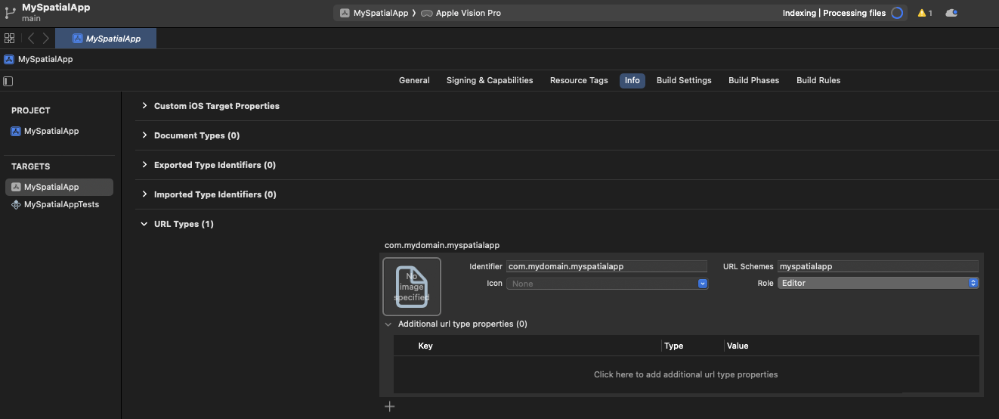
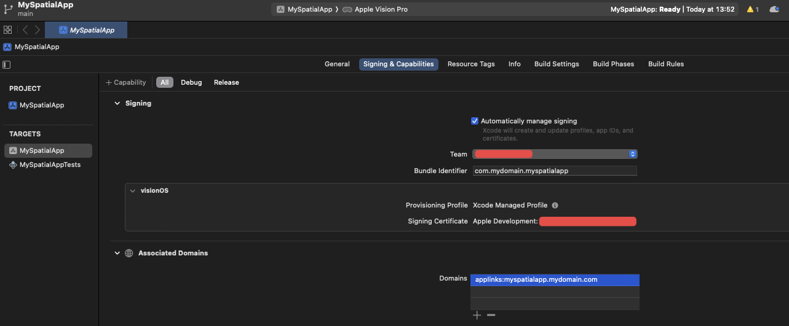

# Deep and Universal Links

Deep and Universal Links work differently on visionOS. Because we are using [SwiftUI lifecycle](/docs/getting-started/entry-point), it's necessary to implement different methods to capture external links.

## Project configuration

First, you need to configure your Xcode project. These are the same steps you need to take for setting up Deep and Universal Links in any standard React Native project.

### Deep Links

For the operating system to be able to detect your app's URL scheme (such as `myspatialapp://`) you need to add URL Types, found in the "Info" tab.

In the "Identifier" field put your app's bundle ID, and in the "URL Schemes" field put your desired URL scheme.



### Universal Links

To be able to support Universal Links, you need to add the associated domain in the "Associated Domains" section of the "Signing & Capabilities" tab.

The associated domain should be in the format `applinks:<your-domain>`. The domain doesn't need to be the same as in your bundle ID, but you need to have access to it because you will need to host a static file called `apple-app-site-association` in order to link your app bundle ID to your website domain.

For additional information, see the official Apple docs on [Supporting associated domains](https://developer.apple.com/documentation/Xcode/supporting-associated-domains).



:::note

The Associated Domains capability requires a paid Apple Developer account.

:::

## Implementation

The recommended way to capture Deep and Universal links is by implementing the `onOpenURL` view modifier.

In `App.swift`, add the `onOpenURL` modifier to `RCTMainWindow` and forward the captured URL to React Native's `RCTLinkingManager`.
```swift title="App.swift"
import SwiftUI
import React
import React_RCTSwiftExtensions

@main
struct MySpatialAppApp: App {
  @UIApplicationDelegateAdaptor var delegate: AppDelegate
  
  var body: some Scene {
    RCTMainWindow(moduleName: "MySpatialApp")
      // Add the view modifier
      .onOpenURL { url in
        // Forward the URL to React Native
        RCTLinkingManager.onOpenURL(url: url)
      }
  }
}


```

Finally, you should be able to access the URL in the JavaScript side by using the standard [React Native Linking API](https://reactnative.dev/docs/linking).

```typescript title="App.tsx"
import {useEffect} from 'react';
import {Linking} from 'react-native';

function App() {
  useEffect(() => {
    const getInitialUrl = async () => {
      const initialUrl = await Linking.getInitialURL();
      console.log('initialUrl', initialUrl);
    };

    getInitialUrl();

    const listener = Linking.addEventListener('url', event => {
      console.log('Received URL: ', event.url);
    });

    return () => {
      listener.remove();
    };
  }, []);
}

```
